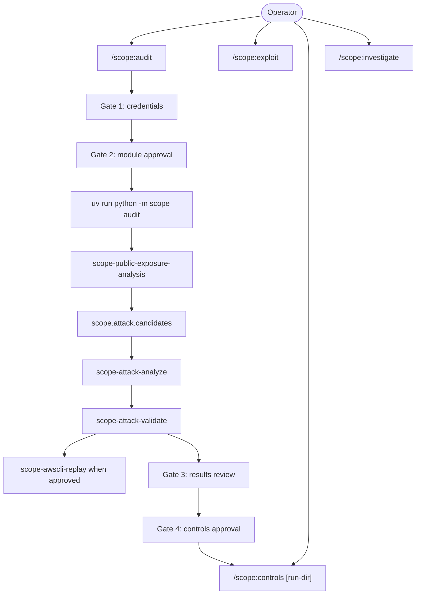
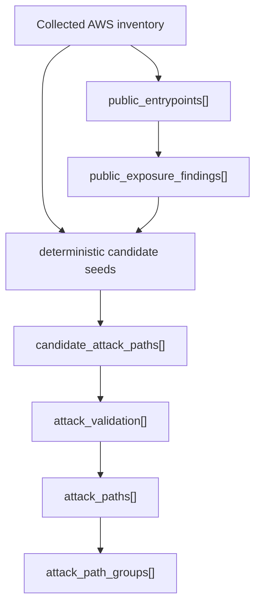
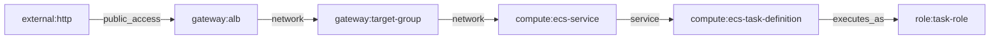
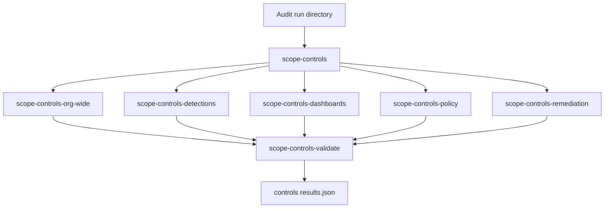
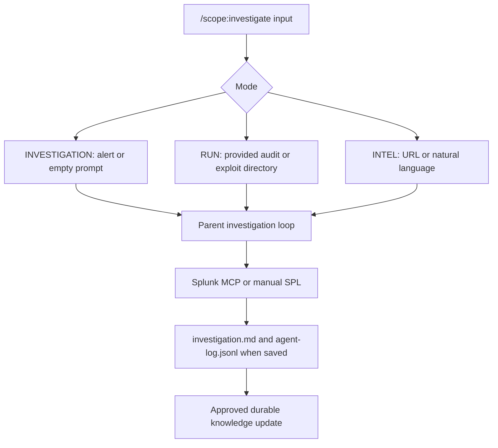
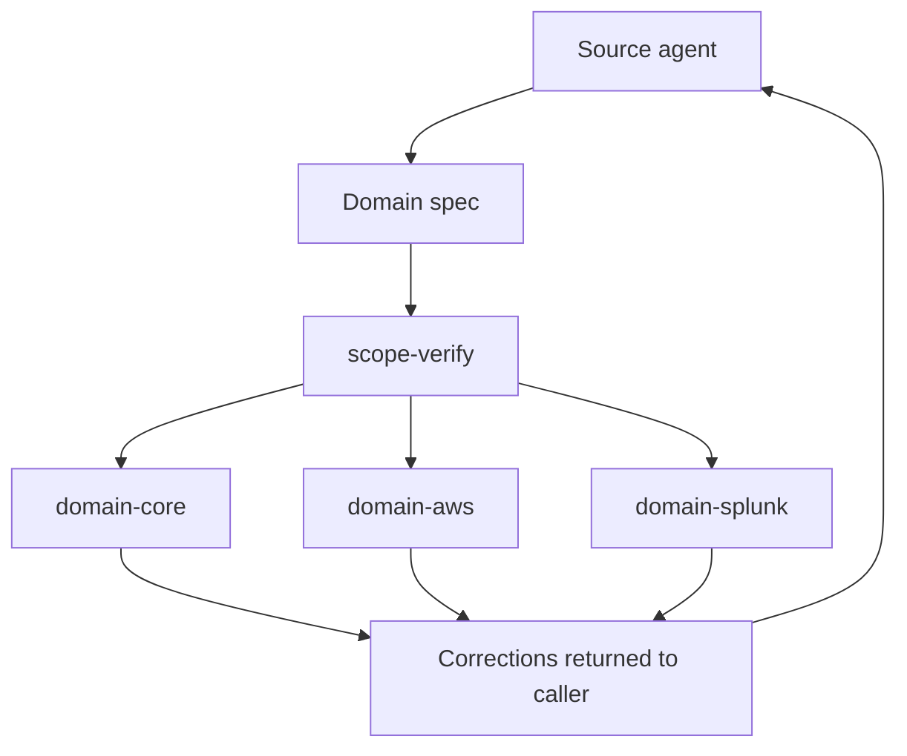
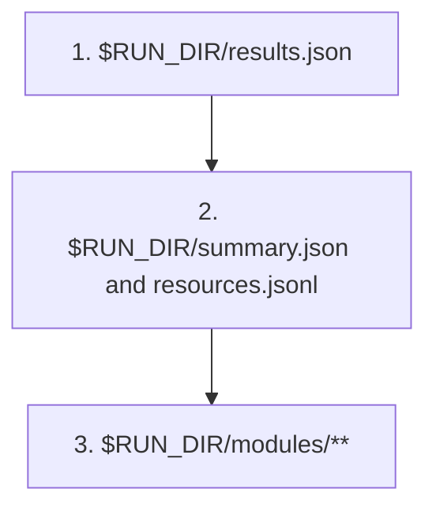
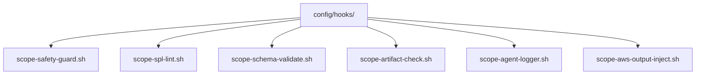

# SCOPE Architecture

SCOPE combines deterministic Python runtime output with bounded AI agents. Python owns AWS enumeration, aggregation, graph extraction, run state, and dashboard export. Agents own orchestration, reasoning, operator gates, and artifact contracts.

## Ownership

| Layer | Owns |
|-------|------|
| `scope.runtime` | `uv run python -m scope audit`, module routing, post-processing, dashboard export |
| `scope.core` | AWS clients, retries, regions, envelopes, coverage, logging, and parallel execution |
| `scope/enumerators/` | Service-specific read-only AWS inventory |
| `scope.attack` | Deterministic candidate seeding and validation helpers |
| `agents/` | Top-level workflows and subagent prompts |
| `skills/` | Reusable local workflows and artifact shaping |
| `config/hooks/` | Safety, schema, SPL, artifact, logging, and output checks |
| `dashboard/` | React and D3 report rendering |

Top-level workflows:

- `scope-audit` runs the audit pipeline and can chain controls after approval.
- `scope-controls` reads an audit run and produces controls artifacts.
- `scope-exploit` creates principal-scoped playbooks and review-only replay artifacts.
- `scope-investigate` runs alert, run-guided, and intel investigation modes.

Bounded subagents:

- `scope-public-exposure-analysis` writes `public_entrypoints[]` and `public_exposure_findings[]`.
- `scope-attack-analyze` adds candidate attack paths and security observations.
- `scope-attack-validate` writes `attack_validation[]`, final `attack_paths[]`, and `attack_path_groups[]`.
- `scope-awscli-replay` builds review-only command artifacts after approval.
- scope-research may enrich attack candidates with bounded external technique context.
- `scope-controls-*` subagents produce and validate controls artifacts.
- `scope-investigate-*` subagents prepare investigation context for the parent workflow.

## System Flow



```mermaid
flowchart LR
    runtime["Python runtime"]
    modules["$RUN_DIR/modules/<service>/<region>.json"]
    summary["summary.json"]
    resources["resources.jsonl"]
    graph["graph.json"]
    results["results.json"]
    dashboard["dashboard/public/<run-id>.json"]
    manifest["dashboard/public/index.json reports[]"]
    html["dashboard/reports/<run-id>-dashboard.html"]

    runtime --> modules
    runtime --> summary
    runtime --> resources
    runtime --> graph
    runtime --> results
    results --> dashboard
    dashboard --> manifest
    manifest --> html
```

`scope audit` writes `summary.json`, `resources.jsonl`, `graph.json`, base `results.json`, per-module envelopes, and dashboard export JSON. Explicit `--run-dir` audits use the run directory basename as the canonical run ID across runtime output and dashboard output.

`dashboard/public/index.json` uses `reports[]`. Each report points to one audit export and optional controls export. The report generator and React UI select reports from that manifest instead of guessing from raw JSON filenames.

## Attack Path Contract

`attack_paths[]` contains validated or conditional attacker progression. `attack_path_groups[]` groups equivalent final paths for human review. Public reachability alone stays in `public_exposure_findings[]`.



Candidate seeds cover collected `sts:AssumeRole`, `iam:PassRole`, CodeBuild `StartBuild`, identity issuance, event paths, resource-policy paths, and public or service-connected paths with concrete or coverage-caveated impact.

The validator promotes a candidate only when collected AWS evidence proves a progression path and a terminal impact. Terminal impact includes data access, decrypt, policy mutation, compute creation, PassRole, resource-policy access, or event injection. Rejected candidates stay out of `attack_paths[]`.

Public reachability to a backend role requires graph evidence from public access through service relationships to an `executes_as` role or identity-provider `authenticates_to` role, plus concrete IAM, Secrets Manager, S3, DynamoDB, or SSM impact. When application behavior must invoke the impact action, the validator marks the path conditional through a runtime-assumption hop.

Resource-policy validation requires statement-level principal, action, resource, and condition matches. Generic `resource_policy_allows` graph edges give context only. `SourceArn`, `SourceAccount`, and `SourceOwner` conditions require matching source context.

S3 object-read paths against SSE-KMS buckets and Secrets Manager reads against CMK-encrypted secrets require KMS authorization evidence. Direct key-policy allow, account-root delegation plus identity `kms:Decrypt`, or a matching KMS grant can satisfy decrypt authorization.

## Relationship Coverage



The graph builder extracts relationship edges from deterministic module envelopes:

- EC2 emits public ingress, security-group attachment, and instance-profile `executes_as` edges.
- ECS emits service, task-definition, load balancer, target group, role, and secret-name relationships. It records environment variable names and secret names only.
- API Gateway emits public endpoint edges, Lambda `invokes` edges, and Lambda execution-role edges.
- Cognito identity pools emit public unauthenticated edges and `authenticates_to` role edges.
- CloudFront and Route 53 correlate collected distribution, alias, origin, and load balancer targets. Unresolved DNS remains exposure context.
- S3 notifications, SNS subscriptions, SQS targets, and Lambda event source mappings emit event-source relationships only when AWS returns the artifacts.
- RDS public endpoints remain exposure until collected credentials, IAM auth, or a service transition proves database access or downstream AWS impact.
- Bedrock agent and knowledge-base posture findings remain findings unless collected role or data transitions prove attacker progression.

## Controls Flow



Controls consume final `attack_paths[]` with `validation_status` of `validated` or `conditional`. They may also consume `public_exposure_findings[]` for remediation, detections, dashboard ideas, and org-wide exposure patterns. Public exposure IDs belong in `source_public_exposure_findings[]`, not `source_attack_paths[]`.

`scope-controls-detections` owns detection quality decisions. `skills/scope-detection-format/SKILL.md` shapes the final `detections.md` and `detections.json` output. `scope-controls-dashboards` writes monitoring recommendations and does not create SIEM objects, saved searches, or deployable dashboards.

## Investigation Flow



Investigation and intel modes do not read prior run directories unless the operator provides one. Run-guided mode reads the specified run directory and uses final `attack_paths[]`. The parent workflow writes artifacts only when the analyst chooses to save.

Top-level agents load bounded context through `skills/scope-knowledge-load/SKILL.md`. They update durable knowledge only through `skills/scope-knowledge-update/SKILL.md` after evidence review or operator approval. Stored knowledge supplies context, not evidence.

## Verification

`scope-verify` runs inline and returns corrections in memory.



Agents pass only the active claim set and selected domain sections. `scope-verify` does not write files.

## Communication Matrix

| Agent | Trigger | Reads | Writes | Calls |
|-------|---------|-------|--------|-------|
| **scope-audit** | `/scope:audit` | AWS APIs through runtime, module envelopes, graph, results | `$RUN_DIR/findings.md`, `results.json`, `summary.json`, `resources.jsonl`, `graph.json`, `aws-cli-replay.json` when paths exist | Python runtime, public exposure, attack analysis, attack validation, replay, controls |
| **scope-controls** | `/scope:controls [run-dir]` or audit chain | Selected audit run | `results.json`, `org-wide-issues.json`, `detections.json`, `dashboards.json`, `policy-replacements.json`, `remediation-plan.md`, `validation-report.md` | controls subagents, `scope-verify` |
| **scope-exploit** | `/scope:exploit` | AWS APIs, optional approved audit run | `playbook.md`, `aws-cli-replay.json`, `results.json`, `agent-log.jsonl` | `scope-research`, `scope-awscli-replay`, `scope-verify` |
| **scope-investigate** | `/scope:investigate` | Bounded knowledge, optional provided run, Splunk MCP or manual SPL | `investigation.md`, `agent-log.jsonl` when saved | investigation intake subagents, `scope-verify` |
| **scope-research** | Dispatched by attack-paths and exploit | External references | Research result in memory | none |
| **scope-awscli-replay** | Dispatched after approval | Approved paths and evidence | Replay result in memory; parent writes artifact | none |

Exploit sequence:

1. Validate identity and target.
2. Dispatch scope-research when the playbook needs source-backed procedure context.
3. Dispatch `scope-awscli-replay` after operator approval.
4. Run inline verification.
5. Write playbook and structured artifacts.

## Data Priority



Downstream agents use `results.json` as the primary consumed artifact. They fall back to summary, resources, and module envelopes for coverage, raw field checks, and debugging.

## Enforcement Layer



| Runtime | Config | Events |
|---------|--------|--------|
| Claude Code | `.claude/settings.json` | PreToolUse, PostToolUse, Stop |
| Antigravity CLI | `.agents/hooks.json` | PreToolUse, PostToolUse, Stop |
| Gemini CLI | `.gemini/settings.json` | BeforeTool, AfterTool, AfterAgent |
| Codex CLI | `.codex/hooks.json` | PreToolUse, PostToolUse, Stop |

Schemas live in `config/schemas/`:

| Schema | Purpose |
|--------|---------|
| `audit.schema.json` | Audit `results.json` |
| `controls.schema.json` | Controls `results.json` |
| `exploit.schema.json` | Exploit `results.json` |
| `module-envelope.schema.json` | Runtime module envelopes |
