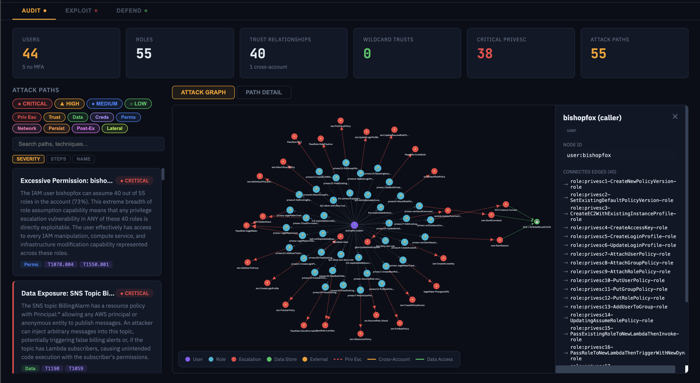
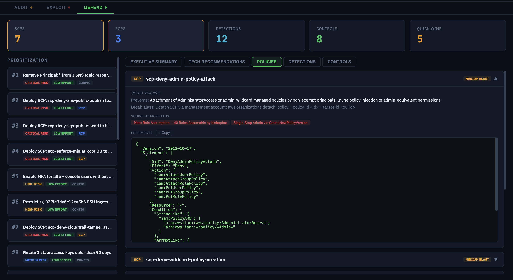
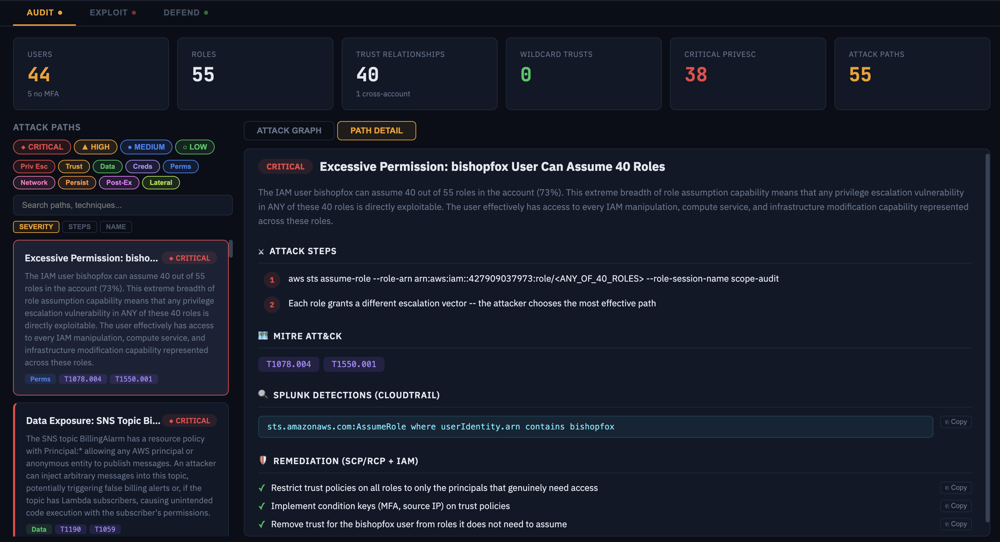

# SCOPE

**AI-powered purple team toolkit for AWS — runs inside Claude Code, Gemini CLI, and Codex.**

SCOPE runs the full security operations loop: enumerate your AWS account, map attack paths, generate defensive controls, and investigate alerts. The AI reasons about what it finds — it doesn't just run scripts.







## Prerequisites

- Node.js
- AWS credentials configured in your environment
- One of: [Claude Code](https://claude.ai/code), [Gemini CLI](https://github.com/google-gemini/gemini-cli), or [Codex](https://github.com/openai/codex)

## Installation

```bash
git clone https://github.com/tayontech/SCOPE.git
cd SCOPE
node bin/install.js --claude   # install for Claude Code
node bin/install.js --gemini   # install for Gemini CLI
node bin/install.js --codex    # install for Codex
node bin/install.js --all      # install for all platforms
```

## AWS Credentials

SCOPE inherits credentials from your shell environment — no custom credential loading. Use a **read-only IAM role** for audit, defend, and investigate.

```bash
export AWS_PROFILE=my-security-readonly-profile
# then launch your editor
/scope:audit --all
```

## Configuration (Optional)

- **`config/accounts.json`** — Owned AWS account IDs. Helps distinguish internal vs external cross-account trusts. Copy `config/accounts.example.json` and fill in your account IDs.
- **`config/scps/*.json`** — Pre-loaded SCPs for when the caller lacks Organizations API access.

## Usage

### 1. Run an audit

From inside Claude Code, Gemini CLI, or Codex:

```
/scope:audit --all                    # Full account audit (all services)
/scope:audit iam s3 kms               # Specific services
/scope:audit arn:aws:iam::123456789012:user/alice   # Specific principal
```

The audit orchestrator will:
- Enumerate resources across IAM, STS, S3, KMS, EC2, Lambda, Secrets Manager, and more
- Pause at operator gates for your approval before proceeding
- Map attack paths across 9 categories (privilege escalation, trust misconfigurations, data exposure, etc.)
- Auto-generate defensive controls (SCPs, Splunk detections) after the audit completes
- Produce an interactive dashboard — open `dashboard/dashboard.html` in any browser

### 2. Generate exploit playbooks

```
/scope:exploit arn:aws:iam::123456789012:user/alice
```

Takes a principal ARN and produces a red team playbook: escalation paths with CLI commands, persistence techniques, and exfiltration vectors. Read-only — generates the playbook but does not execute anything.

### 3. Investigate alerts

```
/scope:investigate
```

Guides you through CloudTrail-based alert investigation in Splunk. Works in two modes:
- **Connected** — Splunk MCP available, queries execute directly after your approval
- **Manual** — No MCP, displays SPL for you to run in Splunk and paste results back

### 4. View the dashboard

```bash
cd dashboard && npm install && npm run dashboard
```

Opens `dashboard/dashboard.html` in any browser — no server required. Shows attack graphs, path details, defensive controls, and Splunk detections from your latest runs.

> **Codex users:** Use dollar-sign prefix with hyphens: `$scope-audit`, `$scope-exploit`, etc.

## Safety

SCOPE is **read-only by default**. Lifecycle hooks block destructive AWS operations at the tool level. Before any write operation, SCOPE shows an approval block with the action, target resources, and risk level — then waits for your explicit Y/N. Approvals are per-step, never batched.

## License

MIT
