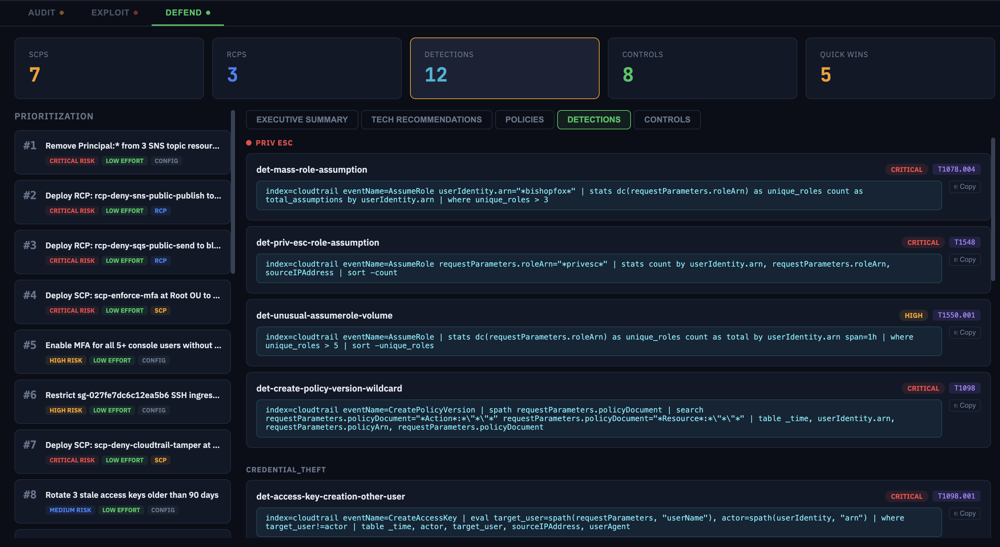
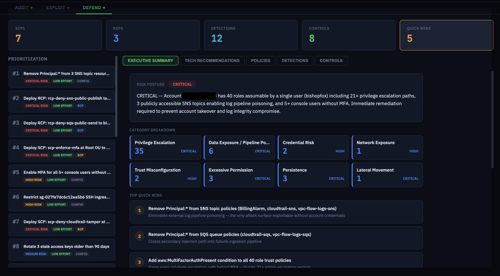
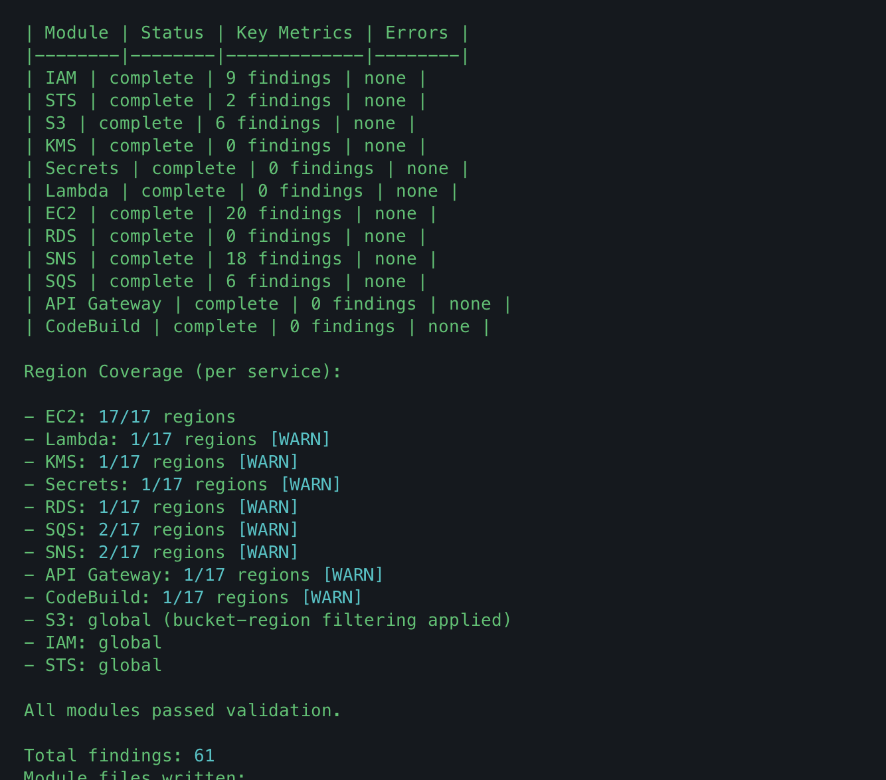
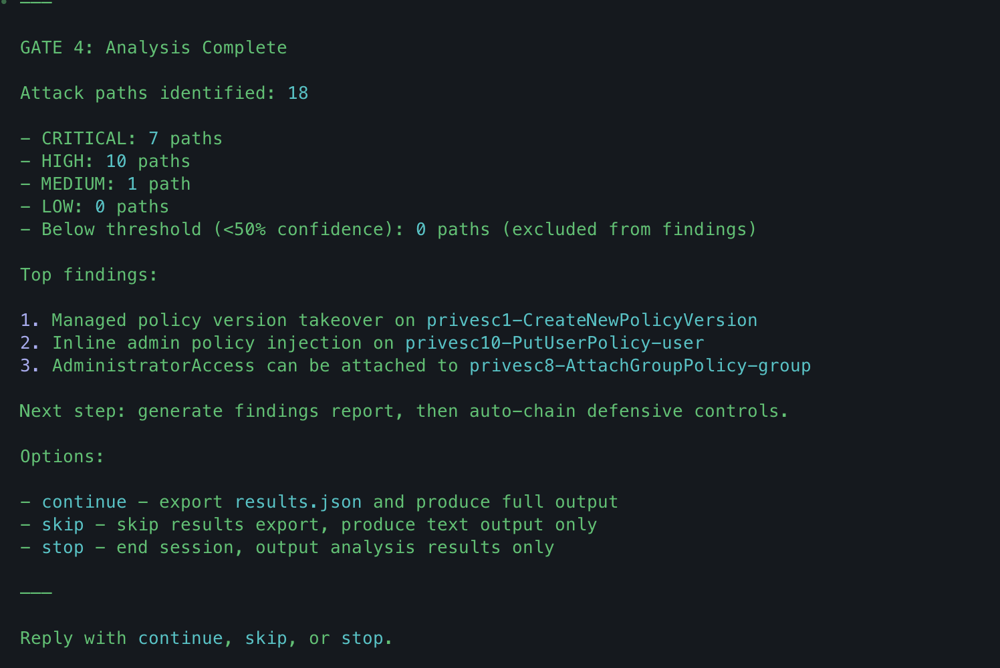

# SCOPE

**AI-powered purple team toolkit for AWS — runs inside Claude Code, Gemini CLI, and Codex.**

SCOPE runs the full security operations loop: enumerate your AWS account, map attack paths, generate defensive controls, and investigate alerts. The AI reasons about what it finds — it doesn't just run scripts.

## Screenshots

### Attack Graph
Interactive D3 visualization of your AWS attack surface — principals, roles, trust relationships, and escalation paths.


### Attack Paths
Categorized attack paths with exploit steps, MITRE ATT&CK mappings, and Splunk detections.


### Defensive Controls
Auto-generated SCPs with deployable policy JSON and Splunk SPL detection rules — tailored to your account's actual misconfigurations.




### Executive Summary
Risk posture breakdown with prioritized quick wins and remediation bundles.



### Terminal Output





## Quick Start

```bash
git clone https://github.com/tayontech/SCOPE.git
cd SCOPE
node bin/install.js --claude   # or --gemini, --codex, --all
```

Set your AWS credentials, then launch your editor:

```bash
export AWS_PROFILE=my-security-readonly-profile
/scope:audit --all
```

## Commands

| Command | What it does |
|---------|-------------|
| `/scope:audit <target>` | Enumerate AWS resources (IAM, STS, S3, KMS, EC2, Lambda, Secrets, and more). Maps attack paths across 9 categories and auto-chains defensive controls. |
| `/scope:exploit <arn>` | Generate red team playbooks — escalation paths, persistence techniques, exfiltration vectors with ready-to-execute CLI commands. |
| `/scope:defend` | Generate SCPs/RCPs, Splunk detections, and security controls based on audit findings. |
| `/scope:investigate` | SOC alert investigation via Splunk — guided queries, timeline building, IOC correlation. |

> **Codex users:** Use dollar-sign prefix with hyphens: `$scope-audit`, `$scope-exploit`, etc.

## Safety

SCOPE is **read-only by default**. Lifecycle hooks block destructive AWS operations at the tool level. Before any write operation, SCOPE shows an approval block with the action, target resources, and risk level — then waits for your explicit Y/N. Approvals are per-step, never batched. Exploit generates playbooks but does not execute them.

## Documentation

See [`docs/`](docs/) for architecture details, configuration options, verification protocol, and output format reference.

## License

MIT
